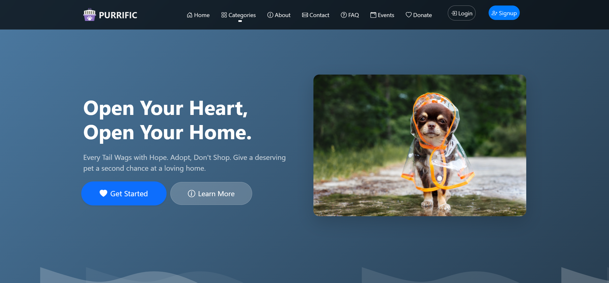
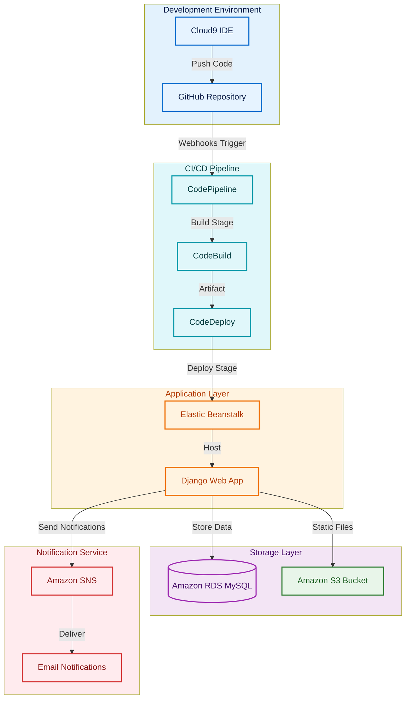

# Purrfect Dog - Pet Management Web Application



A Django-based web application for pet lovers to manage their pets, events, and connect with other pet owners. Originally built with AWS cloud services, now deployed on Render with SQLite.

## Key Features
- 🐾 User registration & authentication
- 🐶 Pet profile management (add/edit/delete pets)
- 📅 Event creation and management for pet meetups
- 📞 Contact form for user inquiries
- 🔍 Search & filter pets by type, breed, age
- 📸 Image uploads for pets and events
- 📱 Responsive design for mobile devices
- 🔍 **Advanced Search** powered by custom-made [petsearch](#petsearch-library) library

## Technologies Used
- **Frontend**: HTML5, CSS3, JavaScript, Bootstrap 5
- **Backend**: Django 5.0
- **Database**: SQLite (RDS MySQL version available in AWS branch)
- **Deployment**: Render.com (AWS Elastic Beanstalk version available in AWS branch)
- **Storage**: Local file storage (AWS S3 version available in AWS branch)

## Installation (Local Development)
1. Clone repository:
   ```bash
   git clone https://github.com/N2B6/Purrificapp.git
   cd Purrificapp
   ```


2. Create virtual environment:
   ```bash
   python -m venv venv
   source venv/bin/activate  # Linux/Mac
   venv\Scripts\activate  # Windows
   ```

3. Install dependencies:
   ```bash
   pip install -r requirements.txt
   ```

4. Run migrations:
   ```bash
   python manage.py migrate
   ```

5. Create superuser:
   ```bash
   python manage.py createsuperuser
   ```

6. Run development server:
   ```bash
   python manage.py runserver
   ```

<!-- ## Deployment on Render
1. Create new **Web Service** on Render
2. Connect your GitHub repository
3. Set environment variables:
   ```env
   PYTHON_VERSION = 3.9.6
   DJANGO_SETTINGS_MODULE = CAT.settings
   ```
4. Set build command:
   ```bash
   pip install -r requirements.txt && python manage.py migrate
   ```
5. Set start command:
   ```bash
   gunicorn CAT.wsgi:application -->
   <!-- ``` -->

## AWS Architecture (Original Implementation)
This project was originally deployed using these AWS services:

```plaintext
- Cloud9 IDE: Development Environment
- GitHub Repository: Version Control
- CodePipeline: CI/CD Orchestration
- CodeBuild: Build Automation
- CodeDeploy: Deployment Service
- Elastic Beanstalk: Application Hosting
- Amazon RDS MySQL: Database Service
- Amazon S3 Bucket: Media Storage
- Amazon SNS: Notification Service
```



## Project Structure
```plaintext
purrfect-dog/
├── CAT/                   # Django project config
│   ├── __init__.py
│   ├── settings.py        # Combined AWS/Render settings
│   ├── urls.py
│   └── wsgi.py
├── KITTEN/                # Main application
│   ├── migrations/
│   ├── templates/
│   │   ├── base.html      # Base template
│   │   └── mylistings.html # Pet listings
│   ├── static/
│   │   ├── admin/         # Django admin static files
│   │   ├── css/           # Custom styles
│   │   └── js/            # Custom scripts
│   ├── models.py          # Database models
│   ├── views.py           # Application logic
│   └── urls.py            # URL routing
├── petsearch/             # Custom search library
│   └── petsearch.egg-info/
├── requirements.txt       # Dependencies
└── manage.py              # Django CLI
```

## petsearch Library
Custom Python library for pet filtering and sorting. Key capabilities:

```python
# Example usage in views.py
from petsearch import PetFilter

def pet_list(request):
    filters = {
        'type': request.GET.get('pet_type'),
        'age_min': request.GET.get('age_min'),
        'breed': request.GET.get('breed')
    }
    filtered_pets = PetFilter(filters).execute()
    return render(request, 'mylistings.html', {'pets': filtered_pets})
```

**Features**:
- Multi-criteria filtering (type, breed, age)
- Weighted sorting algorithm
- Pagination support
- Search relevance scoring

## Credits
- Developed by [Nipun Bakshi](https://www.linkedin.com/in/nipunbakshi/)
- Django Framework 5.0
- Render.com for free hosting

<!-- [](https://purrificapp.onrender.com) -->


<!-- Or for HTML-compatible rendering (e.g., GitHub Pages) -->
<a href="https://purrificapp.onrender.com" style="display: inline-block; padding: 12px 24px; background-color: #5f3dc4; color: white; border-radius: 5px; text-decoration: none; font-weight: bold; transition: all 0.3s ease; border: 2px solid #4a2fa3; box-shadow: 0 2px 4px rgba(0,0,0,0.2);">
    🚀 Check it live on Render
</a>
